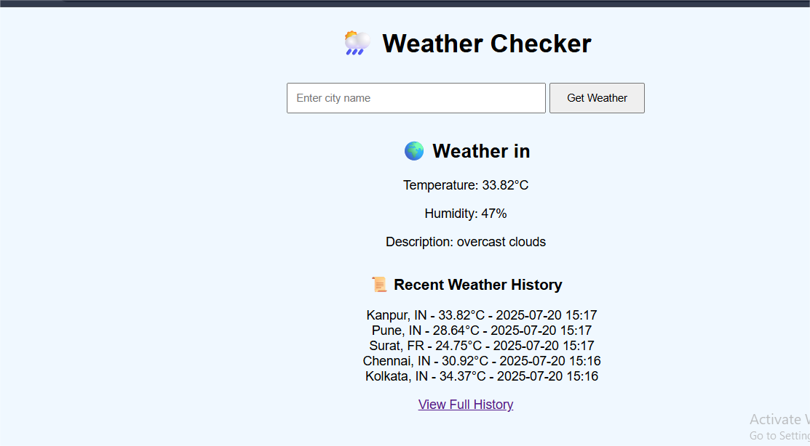
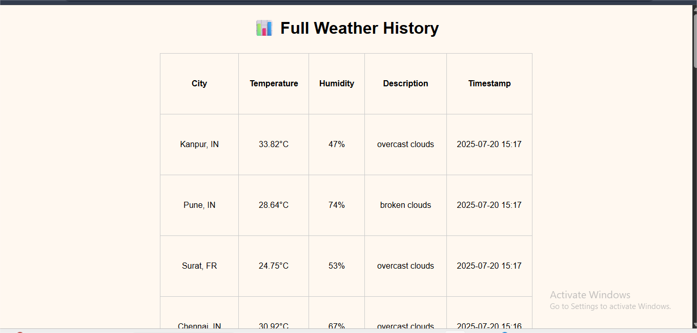
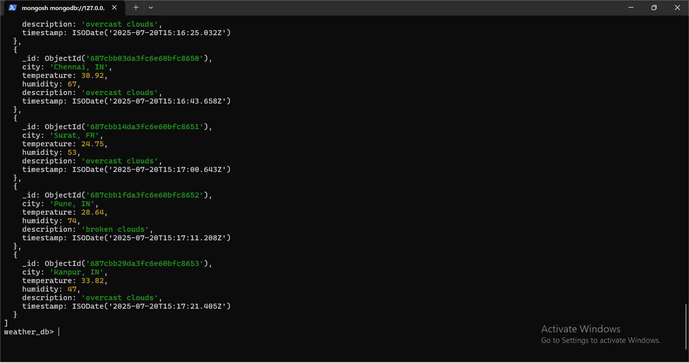

# 🌤️ Weather App

A modern weather application built with **Flask**, **MongoDB**, and **OpenWeather API**. This app allows users to search for any city and view the current weather and the recent search history. Weather data is stored in MongoDB and can be queried later.

---

## 🚀 Features

- 🔍 Search weather by city name
- 📆 View search history of different city's weather
- 💾 Store and view weather history
- 🧠 MongoDB database integration
- ⚠️ Handles invalid city inputs gracefully

---

## 🛠 Tech Stack

- **Frontend:** HTML, CSS
- **Backend:** Python (Flask)
- **Database:** MongoDB
- **API:** OpenWeatherMap

---

## 🖼️ Screenshots


<br>

<br>


---

## 🧪 How to Run Locally

1. Clone the repository:
   ```bash
   https://github.com/Nisha-dev1/Weather-App.git
   cd weather-app

## 🙋‍♀️ Author

**Nisha Rani** <br>
Python Developer | Frontend Enthusiast


